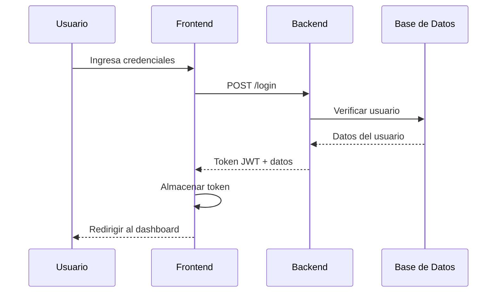
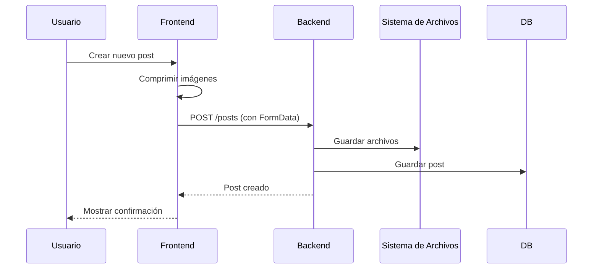
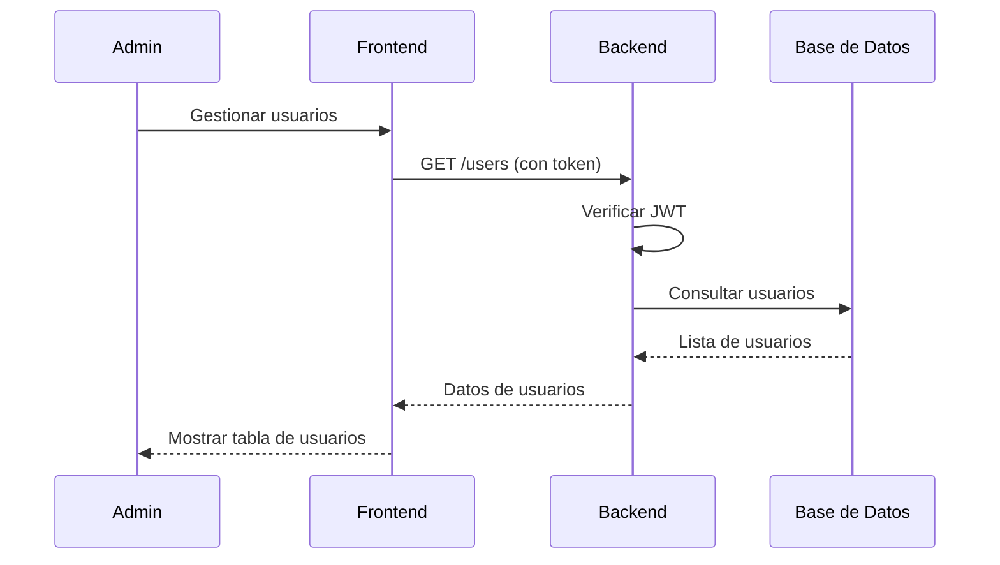

# Documentación del Proyecto - Faustinee

## Descripción General

**Faustinee** es una plataforma completa de blog/CMS (Content Management System) desarrollada con arquitectura de microservicios. El proyecto combina un backend robusto en PHP con un frontend moderno en React, proporcionando una solución integral para la gestión de contenido web.

## Arquitectura del Sistema

```
┌─────────────────┐    ┌─────────────────┐    ┌─────────────────┐
│   Frontend      │    │   Backend       │    │   Base de       │
│   (React)       │◄──►│   (PHP/Slim)    │◄──►│   Datos         │
│   Port: 5173    │    │   Port: 8001    │    │   (MySQL)       │
└─────────────────┘    └─────────────────┘    └─────────────────┘
```

## Tecnologías Utilizadas

#### Frontend
- **React 18.3** - Biblioteca de UI
- **TypeScript 5.6** - Tipado estático
- **Vite 6.0** - Herramienta de construcción
- **Tailwind CSS 3.4** - Framework de estilos
- **Zustand 5.0** - Gestión de estado
- **TipTap 3.0** - Editor de texto enriquecido

#### Backend
- **PHP 8.4+** - Lenguaje de programación
- **Slim Framework 4.15** - Framework web
- **PDO MySQL** - Acceso a base de datos
- **JWT** - Autenticación basada en tokens

#### Base de Datos
- **MySQL** - Sistema de gestión de base de datos
- **UTF8MB4** - Codificación de caracteres

## Estructura del Proyecto

```
faustinee/
├── api/                          # Backend PHP
│   ├── app/                      # Lógica de aplicación
│   │   ├── db/models/            # Modelos de datos
│   │   ├── middleware/           # Middleware personalizado
│   │   └── routes/controllers/   # Controladores de API
│   ├── config/                   # Configuración
│   ├── public/uploads/           # Archivos subidos
│   ├── vendor/                   # Dependencias PHP
│   ├── composer.json             # Dependencias
│   ├── index.php                 # Punto de entrada
│   └── BACKEND_DOCUMENTATION.md  # Documentación del backend
├── frontend/                     # Frontend React
│   ├── src/                      # Código fuente
│   │   ├── components/           # Componentes React
│   │   ├── hooks/                # Hooks personalizados
│   │   ├── pages/                # Páginas de la aplicación
│   │   ├── stores/               # Stores de estado
│   │   └── interfaces/           # Definiciones TypeScript
│   ├── public/                   # Archivos públicos
│   ├── package.json              # Dependencias Node.js
│   └── FRONTEND_DOCUMENTATION.md # Documentación del frontend
└── PROJECT_DOCUMENTATION.md      # Esta documentación
```

## Instalación y Configuración

### Prerrequisitos
- **PHP 8.4+** con extensiones PDO, JSON, OpenSSL
- **MySQL 8.0+** o MariaDB 10.3+
- **Node.js 18+** y npm
- **Composer** para dependencias PHP
- **Servidor web** (Apache/Nginx) o PHP built-in server

### Instalación del Backend

1. **Navegar al directorio del backend**:
   ```bash
   cd api/
   ```

2. **Instalar dependencias PHP**:
   ```bash
   composer install
   ```

3. **Configurar variables de entorno**:
   ```bash
   cp .env.example .env
   # Editar .env con tus credenciales
   ```

4. **Configurar base de datos**:
   - Crear base de datos `faustinee`
   - Importar esquema si es necesario

5. **Ejecutar servidor**:
   ```bash
   php -S localhost:8001 -t . index.php
   ```

### Instalación del Frontend

1. **Navegar al directorio del frontend**:
   ```bash
   cd frontend/
   ```

2. **Instalar dependencias Node.js**:
   ```bash
   npm install
   ```

3. **Configurar variables de entorno**:
   ```bash
   # Crear archivo .env.local
   echo "VITE_API_URL=http://localhost:8001" > .env.local
   ```

4. **Ejecutar servidor de desarrollo**:
   ```bash
   npm run dev
   ```

### Acceso a la Aplicación

- **Frontend**: http://localhost:5173
- **Backend API**: http://localhost:8001
- **Documentación API**: http://localhost:8001 (endpoint raíz)

## Flujo de Trabajo

### 1. Autenticación


### 2. Creación de Post


### 3. Gestión de Usuarios


## API Endpoints

### Rutas Públicas
| Método | Ruta | Descripción |
|--------|------|-------------|
| GET | `/` | Estado de la API |
| GET | `/posts` | Lista pública de posts |
| GET | `/posts/{slug}` | Ver post individual |
| GET | `/covers` | Lista pública de covers |
| POST | `/login` | Iniciar sesión |

### Rutas Protegidas
| Método | Ruta | Descripción |
|--------|------|-------------|
| GET | `/users` | Listar usuarios |
| POST | `/users` | Crear usuario |
| PUT | `/users/{id}` | Actualizar usuario |
| DELETE | `/users/{id}` | Eliminar usuario |
| POST | `/posts` | Crear post |
| PUT | `/posts/{id}` | Actualizar post |
| DELETE | `/posts/{id}` | Eliminar post |
| POST | `/posts/{id}/img` | Subir imagen |
| POST | `/covers` | Crear cover |
| PUT | `/covers/{id}` | Actualizar cover |
| DELETE | `/covers/{id}` | Eliminar cover |

## Seguridad

### Medidas Implementadas
- **Autenticación JWT** con expiración de 12 días
- **Validación de datos** en frontend y backend
- **Sanitización** de archivos subidos
- **Límites de tamaño** para uploads (50MB)
- **Headers de seguridad** en respuestas HTTP
- **Rutas protegidas** para operaciones administrativas

### Recomendaciones de Producción
- Usar **HTTPS** en producción
- Configurar **CORS** apropiadamente
- Implementar **rate limiting**
- Mantener **dependencias actualizadas**
- Configurar **backup automático** de base de datos


## Despliegue

### Desarrollo Local
```bash
# Terminal 1 - Backend
cd api/
php -S localhost:8001 -t . index.php

# Terminal 2 - Frontend
cd frontend/
npm run dev
```

### Producción

#### Backend
1. Subir archivos a servidor web `/public_html/` => `/public_html/api/`
  - Esta configurado .htacces dirigir las peticiones a `/public_html/api/index.php`
  - Tambien configurado para acceder a la carpeta `/public` directamente
2. Configurar base de datos
3. Configurar variables de entorno
4. Configurar Apache/Nginx

#### Frontend
1. Ejecutar build de producción:
   ```bash
   npm run build
   ```
2. Subir archivos de la carpeta `/dist/` a servidor web  => `/public_html/`
  - Esta configurado desde .htacces para redirigir las solicitudes a `/public_html/index.html`
  - Tambien configurado para dejar libre la ruta `/public_html/api` para ser gestionada por el servidor
3. Configurar servidor para SPA

## Documentación Adicional

- **[Backend Documentation](api/BACKEND_DOCUMENTATION.md)** - Documentación completa del backend
- **[Frontend Documentation](frontend/FRONTEND_DOCUMENTATION.md)** - Documentación completa del frontend
- **[Auth Guide](api/AUTH_GUIDE.md)** - Guía de autenticación
- **[Logs Example](api/logs-example.md)** - Ejemplos de logs y debugging

## Licencia

Este proyecto es privado y pertenece a **Faustinee**. Todos los derechos reservados.

---

**Última actualización**: Octubre 2025  
**Versión**: 1.0.0  
**Estado**: En desarrollo activo
